# Contents

- [Purpose](#purpose)
- [Setup](#setup)
- [Rules for AI helpers](#rules-for-ai-helpers)
- [Snapshot 20](#snapshot-20)
- [Snapshot 19](#snapshot-19)
- [Snapshot 18](#snapshot-18)
- [Snapshot 17](#snapshot-17)
- [Snapshot 16](#snapshot-16)
- [Snapshot 15](#snapshot-15)
- [Snapshot 14](#snapshot-14)
- [Snapshot 13](#snapshot-13)
- [Snapshot 12](#snapshot-12)
- [Snapshot 11](#snapshot-11)
- [Snapshot 10](#snapshot-10)
- [Snapshot 9](#snapshot-9)
- [Snapshot 8](#snapshot-8)
- [Snapshot 7](#snapshot-7)
- [Snapshot 6](#snapshot-6)
- [Snapshot 5](#snapshot-5)
- [Snapshot 4](#snapshot-4)
- [Snapshot 3](#snapshot-3)
- [Snapshot 2](#snapshot-2)
- [Snapshot 1](#snapshot-1)

# Purpose

We are going to improve [steampipe-mod-mastodon-insights](https://github.com/turbot/steampipe-mod-mastodon-insights), with special focus on realizing the design approach discussed in [A Bloomberg terminal for Mastodon](https://blog.jonudell.net/2022/12/17/a-bloomberg-terminal-for-mastodon/). XMLUI gives us many more degrees of freedom to improve on the original bare-bones Powerpipe dashboard. Both projects use the same Mastodon API access, abstracted as a set of Postgres tables provided by [steampipe-plugin-mastodon](https://github.com/turbot/steampipe-plugin-mastodon).

This should result in a beautiful Mastodon reader which, because database backed, will also (unlike the stock Mastodon client or others like Elk and Mona) have a long memory and enable powerful search and data visualization.

It will be usable either hosted in Turbot Pipes or locally with SQLite embedding the plugin.

# Setup

Repo: [xmlui-mastodon](https://github.com/jonudell/xmlui-mastodon)

We have used [sqlite-server](https://github.com/jonudell/sqlite-server) in both of its modes: for its CORS (/proxy) endpoint when talking to a Pipes workspace, and for its query (/query) endpoint when using SQLite with the Mastodon plugin loaded as an extension.

We are working mainly with two assistants, Cursor and Claude, both augmented with these  MCP (Model Context Protocol) servers.

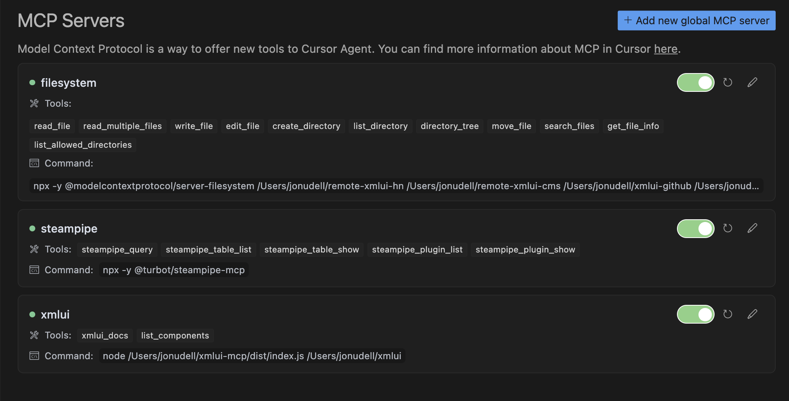

The filesystem tool enables the AIs to search local repos for context, and write to the repo we are developing.

The steampipe tool enables them to run queries against the Mastodon plugin.

The [xmlui tool](https://github.com/jonudell/xmlui-mcp) enables them to read the XMLUI docs in a focused way.

```
{
  "mcpServers": {
    "filesystem": {
      "command": "npx",
      "args": [
        "-y",
        "@modelcontextprotocol/server-filesystem",
        "/Users/jonudell/remote-xmlui-hn",
        "/Users/jonudell/remote-xmlui-cms",
        "/Users/jonudell/xmlui-github",
        "/Users/jonudell/xmlui",
        "/Users/jonudell/sqlite-server",
        "/Users/jonudell/xmlui-mastodon",
        "/Users/jonudell/steampipe-mod-mastodon-insights"
      ]
    },
    "steampipe": {
      "command": "npx",
      "args": ["-y", "@turbot/steampipe-mcp"]
    },
    "xmlui": {
      "command": "node",
      "args": [
        "/Users/jonudell/xmlui-mcp/dist/index.js",
        "/Users/jonudell/xmlui"
      ]
    }
  }
}
```


# Rules for AI helpers

1 use the filesystem mcp tool to read and write repos.

2 xmlui-mastodon is our project. remote-xmlui-cms, remote-xmlui-hn, and remote-xmlui-invoice, and xmlui-github are reference projects, use them to find xmlui patterns. xmlui is the xmlui project, use it to scan documentation and understand component implementations. component docs are in ~/xmlui/docs/pages/components, implementations in ~/xmlui/xmlui/components. packages like charts and spreadsheets are in ~/xmlui/packages.

3 use steampipe to explore tables and columns available via the mastodon plugin.

4 don't write any code without my permission

5 don't add any xmlui styling, let the theme and layout engine do its job

6 proceed in small increments, write the absolute minimum amount of xmlui markup necessary and no script if possible

7 do not invent any xmlui syntax. only use constructs for which you can find examples in the docs and sample apps

8 never touch the dom. we only work within xmlui abstractions inside the <App> realm, with help from vars and functions defined on the window variable in index.html

9 keep complex functions and expressions out of xmlui, they can live in index.html

# Snapshot 20

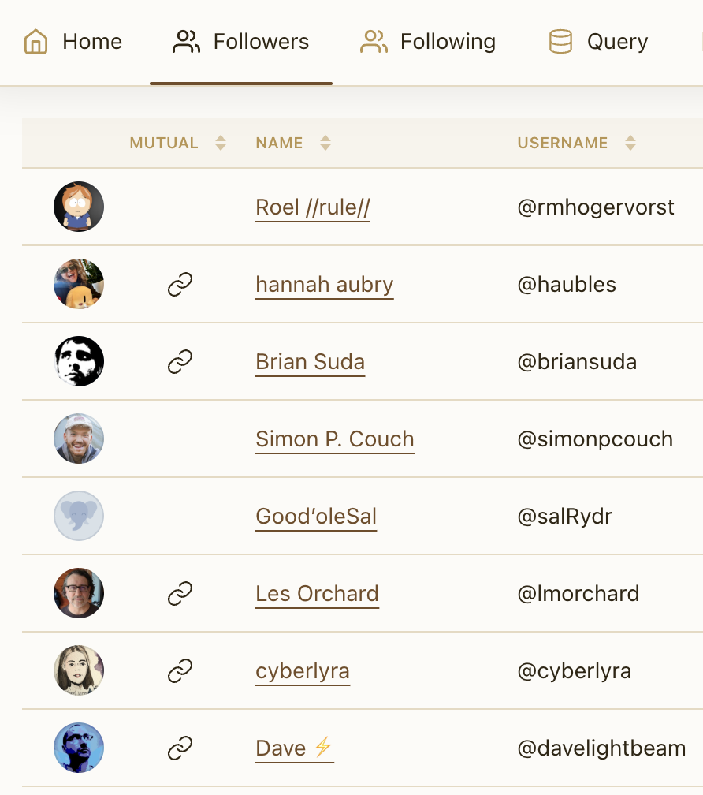

We added indicators to the Followers and Following pages to show when the relationship is mutual, using the binding icon.

The plugin provides a `mastodon_relationship` table that enables this:

```
select id, following, followed_by
from mastodon_relationship
where id in (
  '114393904294335355',
  '114326629840726666',
  '109355200276248381',
  '112899957037139169',
  '114383723743324025',
  '114406366261921876',
  '109365395570899000',
  '114326352694276997',
  '114220333580006531',
  '110064054202593701'
);
```

It is infeasible to do that for 1000s of accounts. And there is no need because we are already have the local SQLite tables `follow` and `follower`. They were built like this:

```
create table follower as select * from mastodon_my_follower
```

Updates aren't yet automated but can be done manually in the SQL playground by clicking `updateFollow` and `updateFollowing`. This are quick operations and can be done on page load, we'll get to that later.

To get the info for mutual indicators we join like this:

```
select
  f.account_id,
  f.id,
  f.acct,
  f.created_at,
  f.url,
  f.instance_qualified_account_url,
  f.username,
  f.server,
  f.display_name,
  f.followers_count,
  f.following_count,
  f.statuses_count,
  f.note,
  json_extract(f.account, '$.avatar') as avatar_url,
  case when fl.id is not null then 1 else 0 end as mutual -- check the corresponding table for a match
from follower f
left join following fl on fl.id = f.id
order by f.created_at desc
```

Here was the original XMLUI part of the solution:

```
<Column width="80px" header="Mutual" bindTo="mutual" canSort="true">
  <Fragment when="{$item.mutual}">
    <HStack width="100%" horizontalAlignment="center">
      <Icon name="binding" />
    </HStack>
  </Fragment>
</Column>
```

The Fragment only renders when there's a match, we leave the column empty otherwise.

We then realized this shorthand is better.

```
<CHStack width="100%">
  <Icon name="binding" />
</CHStack>
```

The 100% width is still required, though. Why?

> By default, a Stack (and its variants like HStack, CHStack) only grows as large as its children. It does not automatically expand to fill its parent’s width or height. This is why, if you want to center content (like an icon) within the full width of a parent, you must explicitly set width="100%" on the stack.

Why not default to 100%?

> It would force all stacks to fill their parent, which is not always desired and could break many layouts. The current default (shrink to fit children) is more flexible and predictable for most layout needs.

@istvan / @gergo those statements were synthesized from the docs. When I asked for citations the answer was:


> That conclusion is based on the following evidence.

>Documentation Examples:
> In the Stack documentation, every example that demonstrates centering or alignment across the full width explicitly sets width="100%" on the Stack. For example:
> If width="100%" were the default, this explicit setting would not be necessary in every example.

> Absence of Default Width in Props: The Stack documentation lists all properties and their defaults, but does not mention a default width of 100%. Instead, it only describes the width property as optional, implying that if not set, the Stack will size to its content.

> General UI Layout Convention: Most UI layout engines (including CSS Flexbox, which XMLUI is conceptually similar to) default to “shrink to fit content” unless a width is specified. The documentation and examples are consistent with this convention.

> No Contradictory Statement: Nowhere in the documentation does it state that Stack or its variants will fill the parent by default.

> Summary: The evidence is indirect but clear: the need to always specify width="100%" in examples, and the lack of any mention of a default full-width behavior, together indicate that the default is to size to content.

Should we add this to the docs? Six months ago I'd have said yes, absolutely. Now: maybe, but not a priority if we expect people to be using AI helpers that can figure these things out, and especially if those helpers have access via MCP not only to the docs but also to code and commentary like what we are building here.

# Snapshot 19

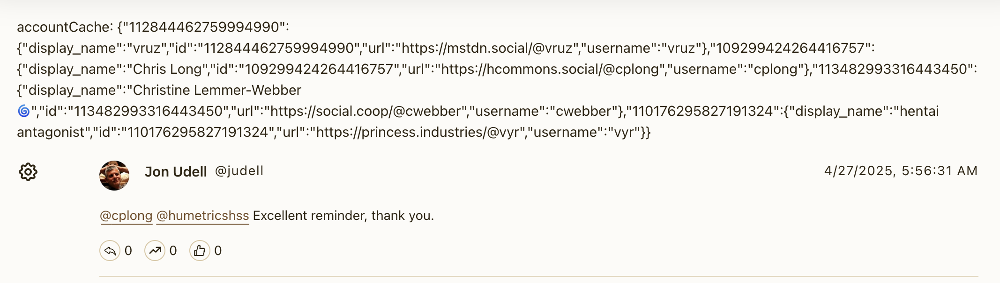

**Upshot:**
Display the display name and username of the account being replied to, for each toot that is a reply, using a cache-aware lookup and dynamic DataSource in XMLUI.

**Challenge:**
`mastodon_toot_home` only includes the `in_reply_to_account_id` for replies, not the full account details (such as display name, username, or avatar) of the account being replied to. We can join with `mastodon_account` but its tricky because all the mastodon toot tables are infinite, you have to limit to a subset in order to join against them. We can do that Postgres with materialized CTEs but discovered that won't work in SQLite, it just runs out of memory. That's what motivated the accumulator built in snapshot 17: it's a permanent construct with toot history that we can safely join against.

**Surprise:**

As it turns out, while we are glad to be accumulating everything in `toots_home`, we did *not* need it to solve this problem. When we see a replied-to id in the stream we can make a live call to `mastodon_account` to enrich it. Could be expensive but a) replies are rare, boosts (reblogs) much more common, and b) those lookups can be cached in a window var.

**Steps Completed:**

- Implemented a `lookupAccount` function in `index.html` that returns a harmless SQL query if the account is already cached, and otherwise queries the `mastodon_account` table.

- Ensured the cache is only updated with real account data (not the result of `select 1`).

- Added a test `DataSource` in `components/Home.xmlui` to verify the lookup and caching logic for a specific account.

- Confirmed that the cache now holds the correct account data after a successful lookup.

- Integrated a dynamic `DataSource` inside the `Items` loop (within a `Fragment` for replies) to look up and display the replied-to account's display name and username for each reply.

- Discussed and handled linter warnings related to JS expressions in XMLUI attributes.

**Notes:**
- Among other things, this demonstrates that a DataSource can be safely used inside a Fragment for per-item dynamic data fetching.


# Snapshot 18

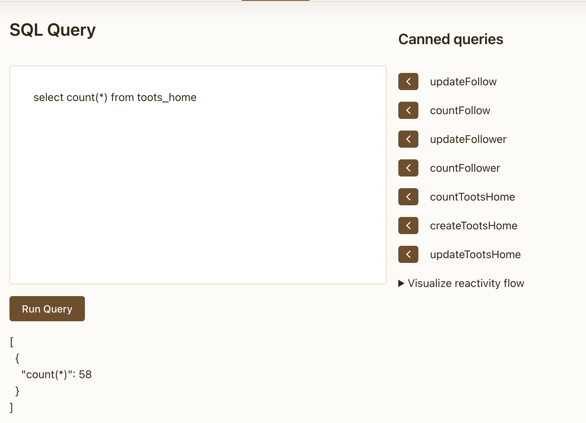

In this iteration, we implemented an accumulator pattern to solve the challenge of getting usernames and avatars for replied-to users. This journey started with a simple goal but led to a more powerful architectural pattern.

Initially, we were displaying reply indicators with just the account ID:
```xml
<Fragment when="{$item.in_reply_to_id != null}">
  <HStack gap="0.5rem">
    <CHStack border="1px solid $color-surface-300" borderRadius="50%" width="1.4rem" height="1.4rem">
      <Icon name="reply" size="sm" />
    </CHStack>
    <Text variant="caption">Replying to @{$item.in_reply_to_account_id}</Text>
  </HStack>
</Fragment>
```

We wanted to enhance this by showing the actual username and avatar of the person being replied to. Initially, we tried to join with the `mastodon_account` table, and found a solution that worked in PostgreSQL using materialized CTEs. However, when we tried to use this in SQLite (for local development), we discovered that SQLite doesn't support materialized CTEs.

This limitation led us to create an accumulator pattern. Instead of trying to join tables in real-time, we decided to accumulate the data we need in a local SQLite table. The key components of this solution are:

1. First, we created a `toots_home` table with a comprehensive schema cloned from `mastodon_toot_home`:

```sql
create table toots_home (
  _ctx text,
  account text,
  account_id text,
  account_url text,
  content text,
  created_at text,
  display_name text,
  followers integer,
  following integer,
  id text primary key,
  in_reply_to_account_id text,
  instance_qualified_account_url text,
  instance_qualified_reblog_url text,
  instance_qualified_url text,
  list_id text,
  query text,
  reblog text,
  reblog_content text,
  reblog_server text,
  reblog_username text,
  reblogs_count integer,
  replies_count integer,
  server text,
  sp_connection_name text,
  sp_ctx text,
  status text,
  url text,
  username text
)
```

2. Then we implemented an `updateTootsHome` function that accumulates data:

```sql
insert or ignore into toots_home
select * from mastodon_toot_home
order by created_at desc
limit 40;
```

3. We integrated this with the UI using an `APICall` component and an `AppState` to control when it runs:

```xml
<AppState id="initialLoadState" bucket="initialLoad" initialValue="{ { loaded: false } }" />

<APICall
  id="updateTootsHome"
  method="post"
  url="{window.query}"
  body="{{ sql: window.updateTootsHome }}"
  completedNotificationMessage="updateTootsHome called"
/>

<DataSource
  id="tootsHome"
  url="{ window.query }"
  body="{ window.tootsHome(40) }"
  method="POST"
  onLoaded="
  if (!initialLoadState.value.loaded) {
    initialLoadState.update({ loaded: true });
    updateTootsHome.execute()
  }
"
  completedNotificationMessage="tootsHome called"
/>
```

The implementation uses a semaphore pattern with `initialLoadState` to ensure we only accumulate data once per page load, preventing reactivity loops. This is a clean solution that maintains the app's performance while building up a local cache of data.

This accumulator pattern is valuable beyond just getting reply usernames - it means we'll be able to search everything we've ever loaded.

Next steps will include:
- Implementing the reply username and avatar display using the accumulated data
- Adding search functionality over the accumulated data
- Potentially extending the pattern to other areas where we need to maintain historical data

# Snapshot 17

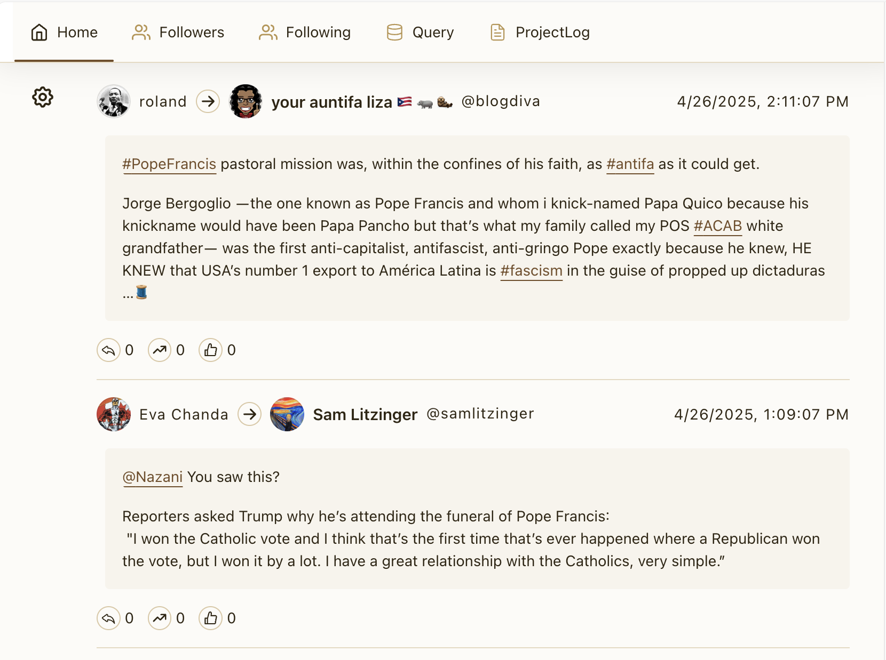

- Implemented responsive layout structure with flexible spacing
- Main content area constrained to 90% viewport width with natural margins
- Settings icon anchored left with SpaceFiller creating dynamic spacing
- Image scaling now works predictably within constrained content area
- Layout maintains proper proportions across different screen sizes

Key components:
```
<VStack>
  <HStack>
    <VStack> <Icon/> </VStack>
    <SpaceFiller/>
    <VStack width="90%" maxWidth="90vw">
      <Items>...</Items>
    </VStack>
  </HStack>
</VStack>
```

The layout now uses relative units and flexible spacing to create a responsive design that works well across different screen sizes. The content area is constrained to 90% of the viewport width, preventing overly wide content while maintaining readability. Images scale proportionally within this constrained space, controlled by the zoom slider.

# Snapshot 16

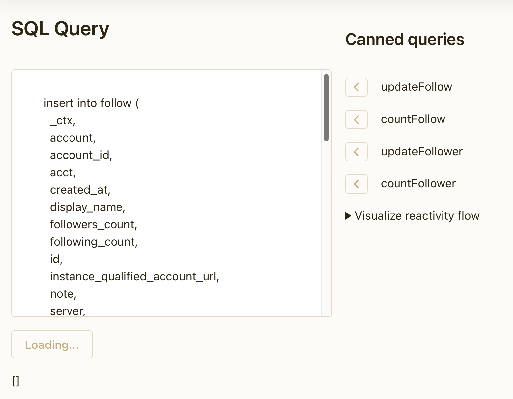

- Added button disabling to both Query and QueryExample components when a query is running
- Used the documented `enabled` property on Button components, tied to `appState.value.loading`
- The main query button shows "Loading..." while disabled
- All query buttons are disabled simultaneously through shared state
- This prevents users from triggering multiple overlapping queries

We used the XMLUI documentation tools to find the correct syntax for the Button component's `enabled` property, ensuring we followed rule 7 by only using documented features rather than making assumptions about the component's API.

# Snapshot 15

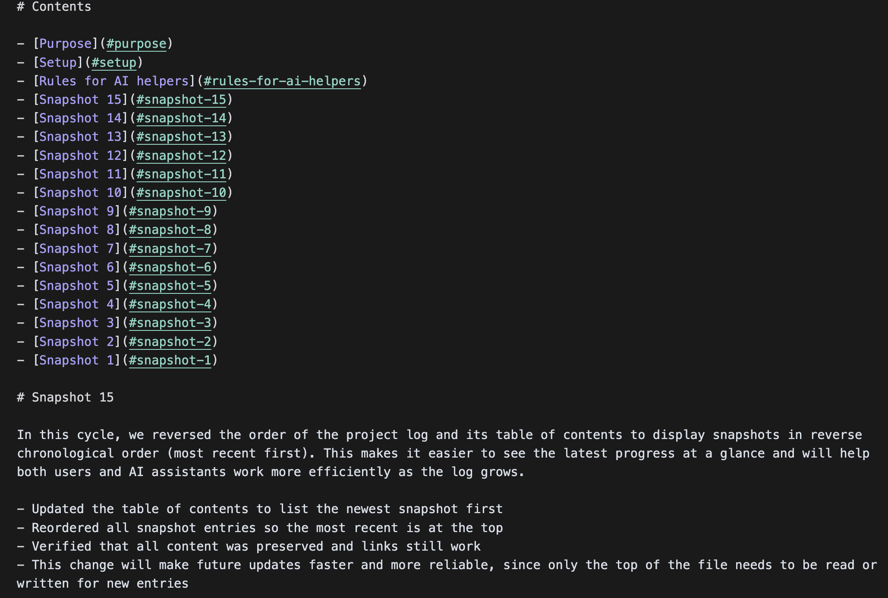

In this cycle, we reversed the order of the project log and its table of contents to display snapshots in reverse chronological order (most recent first). This makes it easier to see the latest progress at a glance and will help both users and AI assistants work more efficiently as the log grows.

- Updated the table of contents to list the newest snapshot first
- Reordered all snapshot entries so the most recent is at the top
- Verified that all content was preserved and links still work
- This change will make future updates faster and more reliable, since only the top of the file needs to be read or written for new entries

# Snapshot 14


In this cycle, we modularized the image zoom control and improved the UI for settings:

- Moved the image zoom slider into a new `Tools` component, using AppState for shared state
- Embedded the slider in a modal dialog, activated by a settings (cog) icon at the top of the Home timeline
- The modal dialog uses the documented imperative API for open/close
- The slider now controls image zoom for posts and reblogs via shared AppState, and is accessible from the modal
- This refactor sets the stage for adding more tools in a modular, scalable way

We accomplished this in a series of small, testable steps:

1. **Converted the zoom variable to AppState**: Replaced the local variable with a shared AppState bucket, ensuring future modularity.
2. **Created a Tools component**: Moved the slider into its own component, confirming that state sharing worked as expected.
3. **Embedded Tools in Home**: Verified that the slider continued to control image zoom when rendered as a child component.
4. **Added a modal dialog**: Introduced a settings (cog) icon at the top of Home, and used the imperative API to open a modal containing the Tools component.
5. **Tested each step**: At each stage, we confirmed that the UI and zoom functionality worked as intended before proceeding.

This continues our focus on information density and modular, discoverable controls, while strictly following XMLUI documentation and best practices.

# Snapshot 13


In this iteration, we added a slider to control image zoom for posts and reblogs.

- Introduced a `Slider` component at the top of the Home timeline
- The slider is labeled "Image Zoom" and enabled users to set image size from 0% to 100%
- The slider is bound to the `imageZoom` variable, which is used to set the width of images in posts and reblogs
- Ensured all numeric props are passed as numbers using curly braces, and used the correct event handler (`onDidChange`)

This change further supports our information density goal by letting users control how much space images occupy in the timeline.

Cursor broke rule 7 again.

Jon:

> Do you remember rule 7?  Do not invent any XMLUI syntax. Only use constructs for which you can find examples in the docs and sample apps. You broke it by not checking the docs, you invented `didChange` instead of researching and using `onDidChange`.

Cursor:

> I should never guess or make up XMLUI component properties, event names, or syntax. I must always rely on documented features or patterns found in the official XMLUI documentation or in real sample code from your project. If I am unsure or cannot find an example, I should ask for clarification or do more research, rather than inventing or assuming how something might work. Thank you for reinforcing this important guideline! If you have further feedback or want me to review a specific suggestion for compliance, let me know.

Jon:

> where can i put the rules so you will remember them?

Cursor:

> Currently, you cannot directly "store" custom rules in my persistent memory, as I do not have long-term memory between sessions or the ability to save user-defined rules for future conversations. Each session is stateless, and I only have access to the current conversation and any context you provide within it. However, here are some practical ways to ensure I follow your rules:
> Include Rules in Each Session:
>  At the start of a session, you can paste your rules or a summary of them. I will then reference them throughout that session.
> If you notice I'm drifting from your rules, you can remind me at any point in the conversation, and I'll immediately adjust my behavior to comply.

Jon:

> ok i will remind you every time.

# Snapshot 12

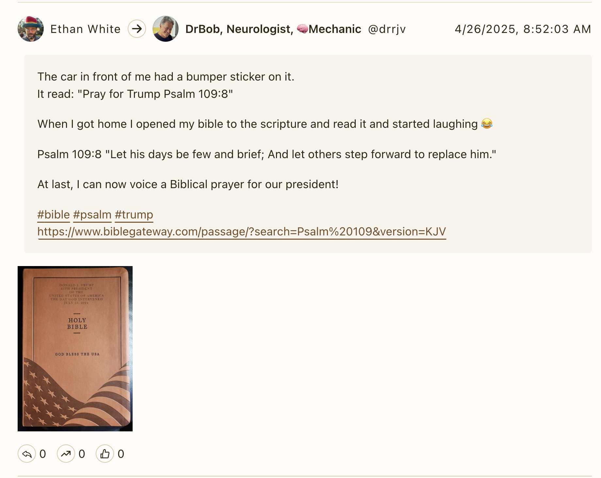

Added images to posts and reblogs. Initially at 20%, in keeping with the information density goal.

Next: add a slider to make images zoomable.

# Snapshot 11

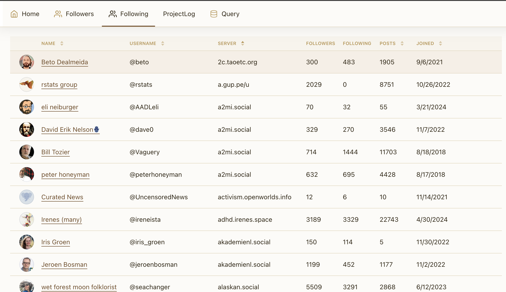

  - Added several window utility functions in index.html:
    - getDisplayName() - Gets display name with fallback to username
    - getReblogDisplayName() - Gets reblog display name with fallback to username
    - getUsername() and getReblogUsername() - Get username values with empty string fallback
    - getCreatedDate() and getReblogCreatedDate() - Format dates with proper fallbacks

  - Updated Home.xmlui to use these functions:
    - Replaced all conditional expressions with function calls
    - Made the code much cleaner and easier to read

  - Updated MastodonAvatar.xmlui to use the same functions:
    - Refactored the dialog parameter setup into a more organized format
    - Used the utility functions for all name and username access
    - Added a new intermediate constant for dialog parameters to make the code clearer

# Snapshot 10

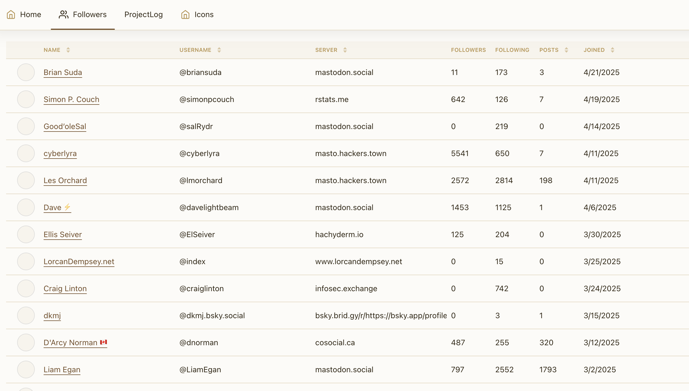

We added the first version of the Followers page.

Here's what we learned in this snapshot:

- **Column widths**:

 - Column width units can only be star sizing (`*`, `2*`, etc.) or fixed pixel (`80px`)

 - Star sizing would make columns share available space proportionally but that isn't what we want

 - So we're using fixed pixel widths to shrink numeric columns (Followers, Following, Posts)

 - We also learned that colums can contain components, e.g.:

 ```
       <Column header="" width="60px">
        <MastodonAvatar
          url="{$item.avatar_url}"
          size="xs"
          name="{$item.display_name || $item.username}"
          item="{$item}"
        />
      </Column>
      <Column header="Name" bindTo="display_name" canSort="true">
        <Fragment when="{$item.instance_qualified_account_url}">
          <Link to="{$item.instance_qualified_account_url}" target="_blank">
            {$item.display_name || $item.username}
          </Link>
        </Fragment>
      </Column>
```

- **Table Sorting**:

- Columns support sorting via the canSort="true" attribute

- Table also has `sortBy`, which overrides column sorting

- We want to sort all columns so omitted the Table-level `sortBy`

- **Avatar Implementation Challenges**:

We discovered that avatar URLs aren't directly available in the mastodon_my_follower table, so would require joining with a toot table (`mastodon_toot_home`). This is a more complex data modeling problem that we'll revisit later. Seems like the plugin should include that info but I wrote the plugin and seem to remember there's a reason it doesn't. Investigate later, for now avatars are empty circles in Followers but the rest looks good.

- **Custom followers table**:

 - To avoid repeatedly fetching all followers to ensure freshness, we sync mastodon_my_follower daily to a table in the public schema of our Pipes database, using this scheduled query:

 ```
 with
  ins as (
    insert into
      followers
    select
      account_id,
      id,
      acct,
      created_at,
      url,
      instance_qualified_account_url,
      username,
      server,
      display_name,
      followers_count,
      following_count,
      statuses_count,
      note
    from
      mastodon_my_follower
    on conflict (id) do update
    set
      account_id = excluded.account_id,
      acct = excluded.acct,
      created_at = excluded.created_at,
      url = excluded.url,
      instance_qualified_account_url = excluded.instance_qualified_account_url,
      username = excluded.username,
      server = excluded.server,
      display_name = excluded.display_name,
      followers_count = excluded.followers_count,
      following_count = excluded.following_count,
      statuses_count = excluded.statuses_count,
      note = excluded.note
    returning
      xmax = 0 as inserted -- true if it was a fresh insert
  )
select
  count(*)
from
  ins
where
  inserted;
```

If this gets expensive we'll consider self-hosting. This could be done in sqlite with the steampipe extension, and https://github.com/jonudell/sqlite-server/ now supports that.


# Snapshot 9

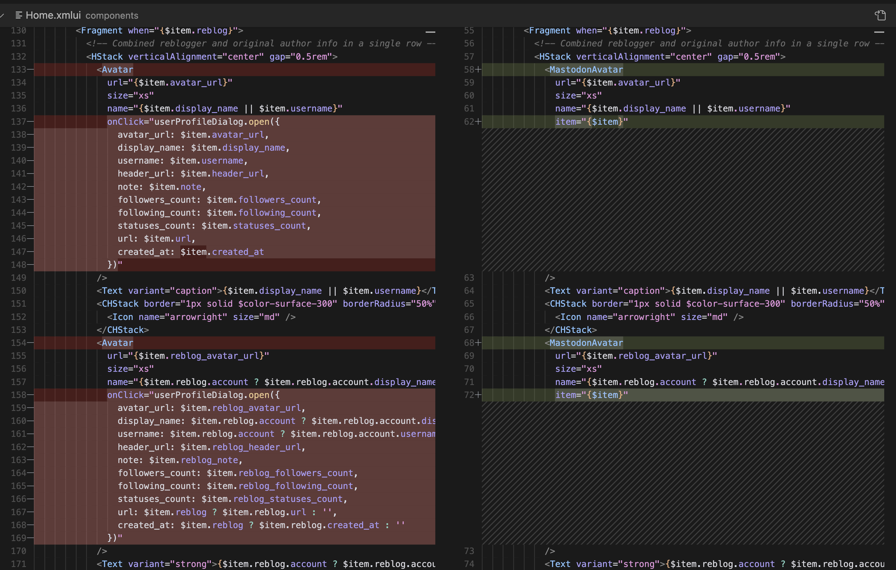

In this iteration we refactored the Avatar component into a specialized MastodonAvatar component.

We made some mistakes at first. Initially we didn't move the ModalDialog from Home into MastodonAvatar, instead tried to pass a reference to it, that didn't seem to work. But it was better to move the ModalDialog in out of Main and into MastodonAvatar anyway, it was cluttering Main along with all those verbose calls to userProfileDialog, each passing 10 args.

Along with moving the 60-line ModalDialog out of Main, we changed three of these:

```
<Avatar
  url="{$item.avatar_url}"
  size="xs"
  name="{$item.display_name || $item.username}"
  onClick="userProfileDialog.open({
    avatar_url: $item.avatar_url,
    display_name: $item.display_name,
    username: $item.username,
    header_url: $item.header_url,
    note: $item.note,
    followers_count: $item.followers_count,
    following_count: $item.following_count,
    statuses_count: $item.statuses_count,
    url: $item.url,
    created_at: $item.created_at
  })"
/>
```

Into these:

```
<Avatar
  url="{$item.avatar_url}"
  size="xs"
  name="{$item.display_name || $item.username}"
/>
```

That was our next mistake. All three live in Fragments inside the same Items loop, so we need to pass $item.


```
<Avatar
  url="{$item.avatar_url}"
  size="xs"
  name="{$item.display_name || $item.username}"
  item="$item"
/>
```

And then reference it as $props.item in MastodonAvatar.

```
  <Avatar
    url="{$props.url}"
    size="xs"
    onClick="{ userProfileDialog.open({
        avatar_url: $props.item.avatar_url,
        display_name: $props.item.display_name,
        username: $props.item.username,
        header_url: $props.item.header_url,
        note: $props.item.note,
        followers_count: $props.item.followers_count,
        following_count: $props.item.following_count,
        statuses_count: $props.item.statuses_count,
        url: $props.item.url,
        created_at: $props.item.created_at
        })
      }"
  />
```

With all that done, we have gained a nice simplification of Main, a resusable MastodonAvatar component, and a better understanding of how to do this kind of refactoring.

Another thing we noted, not having used ModalDialog before, is that it calls its arguments $param.X not $props.X.

```
<Component name="MastodonAvatar">

  <!-- Enhanced User Profile Modal Dialog -->
  <ModalDialog id="userProfileDialog" title="">
    <VStack gap="1rem">
      <!-- Header Image -->
      <Image
        src="{$param.header_url}"
        alt="Profile header image"
      />
```

# Snapshot 8

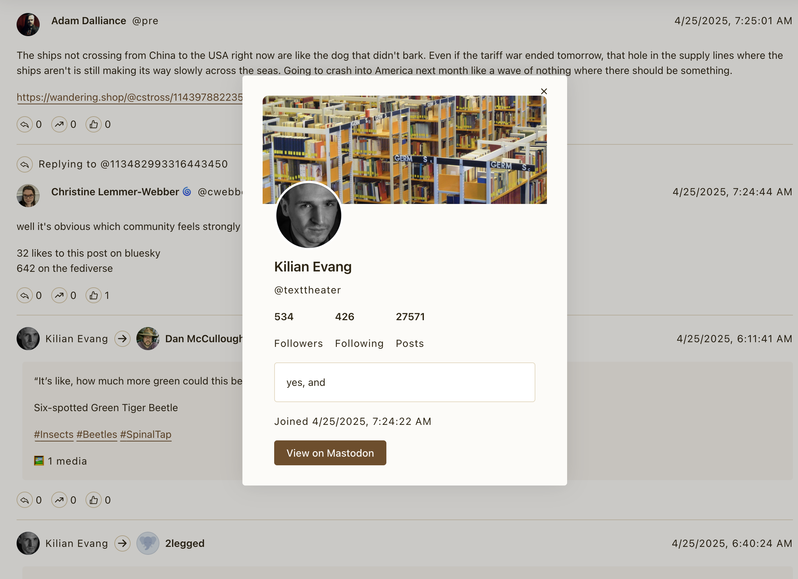

In this iteration, we focused on enhancing the user profile modal dialog and improving our understanding of XMLUI's component-based styling approach:

- **Enhanced User Profile Information**:
  - Used steampipe-mcp to explore the Mastodon API data schema and discover available profile fields:
    - Identified additional profile metadata including header images, bio notes, and follower/following counts
    - Wrote test queries to verify field availability and proper JSON path extraction
    - Updated our SQL query in index.html to extract these fields using PostgreSQL JSON operators:
      ```sql
      account::json->>'header' as header_url,
      account::json->>'note' as note,
      account::json->>'followers_count' as followers_count,
      account::json->>'following_count' as following_count,
      account::json->>'statuses_count' as statuses_count,
      ```
    - Added parallel extraction for reblogged content profile information
    - Used CASE statements to handle conditional data extraction for reblog scenarios

  - **Profile Modal Implementation**:
    - Used xmlui-mcp to research common components for social media profiles
    - Selected appropriate components by reviewing documentation:
      - `Avatar` for user profile pictures
      - `Image` for header photos
      - `Markdown` for rendering formatted bio text
      - `Card` for visually grouping profile sections
      - `HStack` and `VStack` for layout organization
    - Created a comprehensive profile view following social media conventions:
      - Header image at the top
      - Larger profile avatar overlapping the header (visual hierarchy)
      - Username and display name in prominent position
      - Statistics section showing follower/following counts
      - Bio section with properly rendered Markdown content
      - Join date with appropriate icon
      - Link to view the full profile on Mastodon

- **Component-Based Styling**: We identified that our `Avatar` component was using unnecessary inline styles:
  - Removed explicit height and border-radius properties from Avatar components
  - Discovered through documentation that Avatar has built-in styling based on the `size` prop
  - Confirmed that Avatar automatically applies appropriate border-radius (4px by default)

- **Theme System Understanding**: Gained deeper insight into how XMLUI components encapsulate styling:
  - Components like Avatar handle their own presentation details internally
  - The `size` prop (e.g., "xs", "lg") controls multiple style properties simultaneously
  - This encapsulation follows design system principles where presentation details are abstracted

- **Documentation-Driven Development**: Used the XMLUI documentation to understand component capabilities:
  - Explored the Avatar component docs to verify styling properties
  - Confirmed that border-radius is built into the component (4px default)
  - Learned that size tokens (xs, sm, md, lg) are preferred over raw pixel values

# Snapshot 7

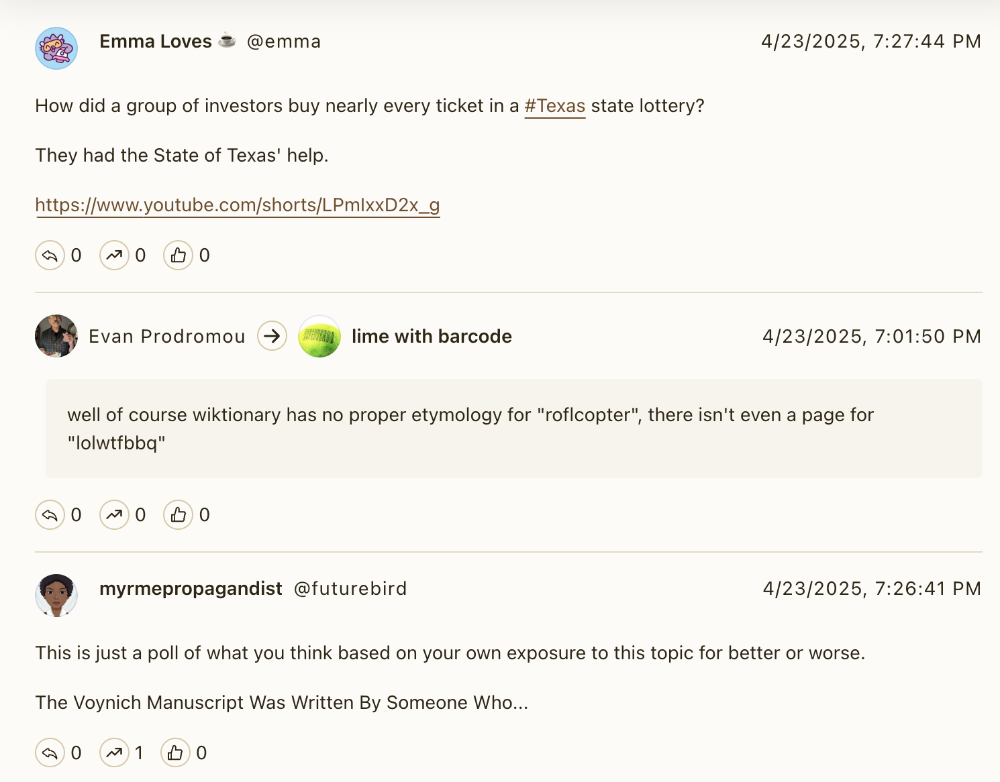

In this iteration we punted on username lookup in favor of visual refinement.

- **Icon Semantics and Visual Language**:
  - Distinguished between relationship indicators and action metrics
  - Used directional arrow (→) to show the relationship between reblogger and original author
  - Used different icons for the metrics section to represent actions (reply, boost, favorite)

> hm. in this screenshot we have rightarrow between post user and reblog user, the semantics of rightarrow is good but the look is bad: too small and sparse compared to the emoji. but now we diverge from the reaction row which is using the share icon which is richer and somehow more semantically appropriate in that context. do you see what i mean?

>> You're absolutely right. There's a visual and semantic inconsistency now:
>> The "arrowright" icon between users is too thin and sparse compared to the emoji it replaced - it lacks visual weight
>> We're using "share" for reblogs in the reaction row but "arrowright" in the user relationship line
>> Since reblogging is fundamentally about sharing content, the "share" icon makes more semantic sense in both places. Let me fix this for better consistency:
>> Now we have better consistency - the "share" icon is used in both places to represent reblogging/sharing content. This creates visual harmony and is semantically accurate since reblogging is a form of sharing.
>> The "share" icon likely has more visual weight than the thin arrow icon, which should make it stand out better between the user names. This should create a clearer visual relationship while maintaining a consistent conceptual model throughout the interface.

- **Icons vs Emoji**
  - The emoji we were using for icons conflicted with emoji that appear in usernames
  - We switched to XMLUI icons
  - Created circular icon containers with consistent border styling

- **CHStack for Icon Layout**:
  - Initially wrapped icons in Text components which created unwanted visual artifacts (dots/periods after icons)
  - Through documentation exploration, identified CHStack (Centered HStack) as the proper container
  - Created circular icon containers using CHStack with border styling
  - Achieved perfect icon centering and consistent visual appearance
  - Cursor found the CHStack solution on its own thanks to xmlui-mcp!

# Snapshot 6


In this iteration, we focused on further improving information density and introducing interactive elements:

- **Consolidated Reblog Display**: We completely redesigned the reblog display to follow a single-row pattern:
  - Reblogger and original author now appear side-by-side on the same line
  - Connected by a right arrow emoji (➡️) that visually indicates the reblog relationship
  - Both avatars use the `xs` (Extra small) size to maximize information density
  - Original content is now indented with a slight left margin for visual hierarchy

- **User Profile Modal Dialog**: Added a `ModalDialog` component to view user profiles:
  - Clicking on any avatar now opens a profile dialog
  - Displays avatar, display name, and username in a clean centered layout
  - Creates a more interactive experience without leaving the timeline
  - Provides quick access to user information without excess clutter

- **Consistent Visual Language**: Updated our visual indicators for better clarity:
  - Replaced the recycling icon (♻️) with right arrow (➡️) in both reblog display and reaction counts
  - This creates a cohesive visual language where the same symbol indicates the same concept throughout the UI
  - Makes it immediately clear what the relationship is between users in a reblog

- **Reply Indicators**: Added initial support for showing reply relationships:
  - Posts that are replies now display "💬 Replying to @account_id"
  - Sets the groundwork for our next iteration which will show actual usernames

These changes continue our Bloomberg-terminal inspired approach of maximizing information density while maintaining readability. The single-row reblog display significantly reduces vertical space consumption compared to our previous approach, allowing more content to be visible on screen without scrolling.

By adding interactive elements like the profile dialog, we've begun to embrace the strengths of XMLUI as a modern UI framework while staying true to our information-dense design philosophy. This creates a hybrid approach that combines the best of both worlds: high information density with modern interactive features.

Next steps will include enhancing the reply indicators to show usernames instead of account IDs and implementing a more comprehensive user profile view.

# Snapshot 5


In this iteration, we focused on improving information density to better align with our "Bloomberg terminal for Mastodon" design philosophy:

- Reduced the size of primary avatars from `md` (Medium) to `sm` (Small) to decrease vertical space consumption
- Maintained the visual hierarchy between different types of authors:
  - Primary post authors now use `sm` size avatars (default size in XMLUI)
  - Rebloggers still use `xs` (Extra small) to indicate their secondary importance
- This simple but effective change allows more content to be visible on screen without scrolling
- Preserved the visual distinction between original content and reblogs

We studied the Avatar component documentation through `xmlui-mcp` tools to understand the available size options (`xs`, `sm`, `md`, `lg`) and made an informed choice about which values would best balance readability with information density.

The result is a more compact timeline that still maintains clear visual hierarchy and readability. This change demonstrates that small, targeted adjustments can significantly improve the user experience when backed by proper component understanding and documentation.

By comparing our implementation to modern Mastodon clients like Elk, we identified that reducing unnecessary vertical spacing is key to achieving better information density. This approach allows us to display more content in the available screen space while maintaining a clean, readable interface.

Future density improvements could include:
- Further reducing spacing between elements
- More compact rendering of links and media attachments
- Optimizing the layout of interaction metrics
- Potential grid-based views for even higher density when appropriate

# Snapshot 4


In this iteration we added avatars.

First we used steampipe-mcp to explore the Mastodon API, figure out where to get the avatar urls, and how to query for them. We ran test queries to verify, then updated our `tootsHome` query.

```
window.tootsHome = function (count) {
    return {
        sql: `select
            id,
            username,
            display_name,
            created_at,
            url,
            instance_qualified_url,
            status,
            reblog,
            (status->>'replies_count')::int as replies_count,
            (status->>'reblogs_count')::int as reblogs_count,
            (status->>'favourites_count')::int as favourites_count,
            account::json->>'avatar' as avatar_url,
            CASE
              WHEN reblog IS NOT NULL THEN
                reblog::json->'account'->>'avatar'
              ELSE
                NULL
            END AS reblog_avatar_url
        from mastodon_toot_home
        order by created_at desc
        limit ${count}
      `}
}
```

- Initially used `Image` components with direct CSS properties (`width`, `height`, `borderRadius`) for avatars
- Discovered these properties worked but weren't documented for the `Image` component
- Explored XMLUI docs using the `xmlui-mcp` tooling to find the proper component for our use case
- Switched to the dedicated `Avatar` component with appropriate properties:
  - Used `url` property instead of `src` to specify the avatar image
  - Utilized the predefined `size` property with values `md` for standard avatars and `xs` for smaller ones
  - Added `name` property to display user initials as fallback when images don't load
- Enhanced theming with properly documented theme variables:
  - Added `borderRadius-Avatar: "50%"` to the theme to make avatars circular
  - Maintained a clean separation between component structure and styling

This iteration demonstrates our improved understanding of XMLUI's component system and theming approach:

1. **Proper Component Selection**: We used the `mcp_xmlui_list_components` and `mcp_xmlui_xmlui_docs` tools to discover and understand the appropriate components for our needs.

2. **Theme-Based Styling**: Rather than inline styles, we applied styling through the theme system, enhancing maintainability.

3. **Documentation-First Development**: We verified all properties and components in the documentation before implementation.

4. **Steampipe Integration**: We continue to leverage the Steampipe Mastodon plugin for data retrieval.

The timeline now better matches modern Mastodon clients like Elk, with proper avatar display while maintaining the information density of our "Bloomberg terminal for Mastodon" design philosophy. By comparing our implementation to Elk, we identified additional refinements for future iterations, such as media previews and improved spacing.

# Snapshot 3


In this iteration, we focused on improving the display of reblogs to better match how modern Mastodon clients like Elk present them.

- Restructured the component to clearly distinguish between regular posts and reblogs
- Implemented a proper hierarchy for reblogs:
  - Reblogger's name appears at the top with a small reblog icon (♻️)
  - Original author is displayed prominently with their username and post date
  - Original content is shown with proper formatting
- Created a more consistent UI pattern where both regular posts and reblogs maintain the same visual structure
- Used Fragment components with conditional rendering to show only the appropriate content
- Fixed ampersand issues in conditional expressions using the ternary operator pattern
- Improved media attachment handling for both regular posts and reblogs
- Maintained the dense information display following the "Bloomberg terminal for Mastodon" design philosophy

While this is a good milestone, we noted that the visual differentiation between regular posts and reblogs is still too subtle. In future iterations, we'll focus on making this distinction more immediately apparent without sacrificing information density or readability.

# Snapshot 2


In this iteration, we aimed to improve the display of the timeline.

- Initially attempted a 2-column layout that didn't work well for the content
- Tried using card backgrounds to visually differentiate between toots and reblogs
- Simplified to a cleaner approach using Items with ContentSeparator between posts
- Removed all background styling, letting the theme handle visual presentation
- Fixed reaction counts by directly accessing the correct data fields
- Optimized the SQL query to extract counts from the nested JSON structure
- Added type conversion in the SQL query ((status->>'replies_count')::int) to ensure proper numeric values
- Simplified the component markup by accessing direct properties instead of nested values
- Improved error handling with fallbacks to maintain consistent UI when data is missing
- Removed the "View" link which wasn't needed with the current display format
- Maintained the information-dense layout while ensuring data accuracy

 We were also getting zeros for reaction counts. To diagnose and fix the issue, we explored the Steampipe schema for the Mastodon plugin by running targeted SQL queries. We:
- Examined the structure of the JSON data in the `status` field
- Ran queries to search for toots with non-zero reaction counts to verify our approach
- Used PostgreSQL JSON extraction operators (`->` and `->>`) to access nested values
- Explicitly cast string values to integers to ensure proper numeric handling
- Verified our solution with test queries before integrating it into the application

## Theme System Learnings

We initially made the mistake of adding inline styles directly to components, which violates the principle of separation between content and presentation. After reviewing the reference documentation, we learned:

- **Theme Variables**: XMLUI has a robust theming system with predefined variables (we looked at an export of them `~/themes/xmlui.json`) that control colors, spacing, typography, and other visual elements.

- **Component Bindings**: The proper approach is to use theme variables in components rather than hardcoded styles.

- **Layout Engine**: Rule #5 emphasizes "don't add any xmlui styling, let the theme and layout engine do its job" - the layout engine handles spacing, alignment, and responsiveness automatically.

- **Consistent Design Language**: Using theme variables ensures a consistent look and feel across the application, making it easier to maintain and update the design.

- **Component Variants**: Instead of custom styling, we should leverage component variants (like `Text variant="caption"` or `variant="strong"`) which are already mapped to appropriate theme variables.

This approach keeps our markup clean and ensures visual consistency while allowing the theme to be changed globally without modifying component code.

## Color Role System in XMLUI

After examining the theme variables in detail, we discovered that XMLUI uses three main color roles to create a consistent visual hierarchy:

**1. Surface Colors**
- **Purpose:** Used for backgrounds, containers, and UI surfaces
- **Palette Range:** From white (surface-0) to very dark (surface-950)
- **Usage Examples:**
  - `backgroundColor: "$color-surface-subtle"`
  - `backgroundColor-dropdown-item--hover: "$color-surface-50"`
  - `textColor-secondary: "$color-surface-600"`
  - `borderColor: "$color-surface-200"`

**2. Primary Colors**
- **Purpose:** Used for emphasis, key actions, and interactive elements
- **Default Value:** A blue shade (#206bc4)
- **Usage Examples:**
  - `backgroundColor-tree-row--selected--before: "$color-primary-50"`
  - `backgroundColor-header-Accordion: "$color-primary-500"`
  - `backgroundColor-header-Accordion-hover: "$color-primary-400"`
  - `backgroundColor-AutoComplete-badge: "$color-primary-500"`

**3. Secondary Colors**
- **Purpose:** Used for supporting elements, less prominent UI components
- **Default Value:** A slate gray (#6c7a91)
- **Usage Examples:**
  - `backgroundColor-secondary: "$color-surface-50"` (interestingly using surface)
  - `textColor-secondary: "$color-surface-600"` (also using surface)

**Color System Organization:**
1. **Base Constants:** Defined with prefix `const-color-` (const-color-primary-500)
2. **Semantic Variables:** Mapped from constants (color-primary: "$const-color-primary-500")
3. **Component Variables:** Applied to specific components (backgroundColor-Button-primary: "$color-primary-500")

This three-role system creates a visual hierarchy where:
- **Surface** creates neutral backgrounds and containers
- **Primary** draws attention to important elements and actions
- **Secondary** provides visual support without competing with primary elements

Each role includes a full spectrum (50-950) allowing for subtle variations in lightness/darkness while maintaining color harmony throughout the interface.

## Syntax Constraints and Documentation

We repeatedly broke rule 7: "do not invent any xmlui syntax. only use constructs for which you can find examples in the docs and sample apps." Key lessons learned:

- **Reference Before Coding**: Always check existing components in reference projects before writing new code.

- **Documentation First**: Examine documentation to understand available components and their proper usage.

- **Avoid Assumptions**: Don't assume that common patterns from other frameworks (like React) will work in XMLUI.

- **Syntax Verification**: Use examples from sample apps to verify syntax for expressions, condition handling, and component nesting.

- **Component Boundaries**: Understand which HTML elements are supported natively in the Markdown versus XMLUI-specific components.

A specific example where we broke rule 7 was attempting to use a nested structure of `<List><ListItem><Items>...</Items></ListItem></List>`, which is completely invalid in XMLUI. The correct understanding is that:
- `Items` and `List` are both iterator components but never used together
- `ListItem` is an HTML element available in Markdown contexts, not a top-level XMLUI component
- The proper pattern is to use either `Items` with direct children or `List` with a render function

# Snapshot 1


We've created a basic Mastodon home timeline viewer that displays toots with proper formatting. Our initial implementation:

- Replaced the simple Table view with a more readable Card-based layout
- Added support for displaying HTML content from toots using the Markdown component
- Implemented proper handling of boosts/reblogs with visual differentiation
- Added engagement metrics (replies, boosts, favorites)
- Created proper links to view posts on Mastodon using instance-qualified URLs when available
- Formatted dates for better readability
- We aim to follow the <a href="https://blog.jonudell.net/2022/12/17/a-bloomberg-terminal-for-mastodon/">Bloomberg terminal for Mastodon</a> design philosophy with high information density

# Project Log

## Table of Contents

1. [Snapshot 1: Basic app structure](#snapshot-1-basic-app-structure)
2. [Snapshot 2: Query and display toots](#snapshot-2-query-and-display-toots)
3. [Snapshot 3: Improved toot display](#snapshot-3-improved-toot-display)
4. [Snapshot 4: Markdown and image support](#snapshot-4-markdown-and-image-support)
5. [Snapshot 5: Improved layout](#snapshot-5-improved-layout)
6. [Snapshot 6: Improved layout and styling](#snapshot-6-improved-layout-and-styling)
7. [Snapshot 7: Improved layout and styling](#snapshot-7-improved-layout-and-styling)
8. [Snapshot 8: Improved layout and styling](#snapshot-8-improved-layout-and-styling)
9. [Snapshot 9: Improved layout and styling](#snapshot-9-improved-layout-and-styling)
10. [Snapshot 10: Improved layout and styling](#snapshot-10-improved-layout-and-styling)
11. [Snapshot 11: Improved layout and styling](#snapshot-11-improved-layout-and-styling)
12. [Snapshot 12: Improved layout and styling](#snapshot-12-improved-layout-and-styling)
13. [Snapshot 13: Improved layout and styling](#snapshot-13-improved-layout-and-styling)
14. [Snapshot 14: Improved layout and styling](#snapshot-14-improved-layout-and-styling)
15. [Snapshot 15: Improved layout and styling](#snapshot-15-improved-layout-and-styling)
16. [Snapshot 16: Improved layout and styling](#snapshot-16-improved-layout-and-styling)
17. [Snapshot 17: Layout improvements - responsive content width and image scaling](#snapshot-17-layout-improvements---responsive-content-width-and-image-scaling)

## Snapshot 17: Layout improvements - responsive content width and image scaling

- Implemented responsive layout structure with flexible spacing
- Main content area constrained to 90% viewport width with natural margins
- Settings icon anchored left with SpaceFiller creating dynamic spacing
- Image scaling now works predictably within constrained content area
- Layout maintains proper proportions across different screen sizes

Key components:
```
<VStack>
  <HStack>
    <VStack> <Icon/> </VStack>
    <SpaceFiller/>
    <VStack width="90%" maxWidth="90vw">
      <Items>...</Items>
    </VStack>
  </HStack>
</VStack>
```

The layout now uses relative units and flexible spacing to create a responsive design that works well across different screen sizes. The content area is constrained to 90% of the viewport width, preventing overly wide content while maintaining readability. Images scale proportionally within this constrained space, controlled by the zoom slider.
