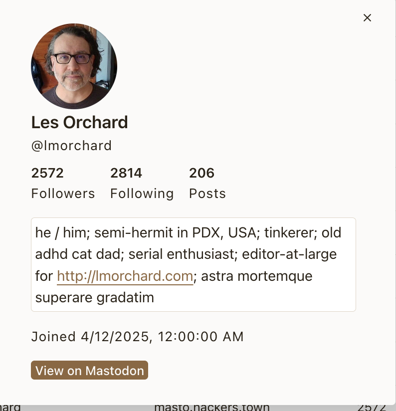

# Contents

- [Purpose](#purpose)
- [Setup](#setup)
- [Rules for AI helpers](#rules-for-ai-helpers)
- [Snapshot 1](#snapshot-1)
- [Snapshot 2](#snapshot-2)
- [Snapshot 3](#snapshot-3)
- [Snapshot 4](#snapshot-4)
- [Snapshot 5](#snapshot-5)
- [Snapshot 6](#snapshot-6)
- [Snapshot 7](#snapshot-7)
- [Snapshot 8](#snapshot-8)
- [Snapshot 9](#snapshot-9)

# Purpose

We are going to improve [steampipe-mod-mastodon-insights](https://github.com/turbot/steampipe-mod-mastodon-insights), with special focus on realizing the design approach discussed in [A Bloomberg terminal for Mastodon](https://blog.jonudell.net/2022/12/17/a-bloomberg-terminal-for-mastodon/). XMLUI gives us many more degrees of freedom to improve on the original bare-bones Powerpipe dashboard. Both projects use the same Mastodon API access, abstracted as a set of Postgres tables provided by [steampipe-plugin-mastodon](https://github.com/turbot/steampipe-plugin-mastodon).

This should result in a beautiful Mastodon reader which, because database backed, will also (unlike the stock Mastodon client or others like Elk and Mona) have a long memory and enable powerful search and data visualization.

It will be usable either hosted in Turbot Pipes (for propellerheads) or locally in SQLite (for civilians).

# Setup

Repo: [xmlui-mastodon](https://github.com/jonudell/xmlui-mastodon)

We are using sqlite-server, but only for its CORS proxy. Although we could be using the steampipe Mastodon plugin in sqlite (see xmlui-github), here we are using a remote steampipe in a Turbot Pipes workspace, our queries use the Pipes query API via the local CORS proxy.

We are working with two assistants, Cursor and Claude, both augmented with these  MCP (Model Context Protocol) servers.

```
{
  "mcpServers": {
    "filesystem": {
      "command": "npx",
      "args": [
        "-y",
        "@modelcontextprotocol/server-filesystem",
        "/Users/jonudell/remote-xmlui-hn",
        "/Users/jonudell/remote-xmlui-cms",
        "/Users/jonudell/xmlui-github",
        "/Users/jonudell/xmlui",
        "/Users/jonudell/sqlite-server",
        "/Users/jonudell/xmlui-mastodon"
        "/Users/jonudell/steampipe-mod-mastodon-insights"
      ]
    },
    "steampipe": {
      "command": "npx",
      "args": [
        "-y",
        "@turbot/steampipe-mcp"
      ]
    }
  }
}
```

The filesystem tool enables the AIs to search local repos for context, and write to the repo we are developing.

The steampipe tool enables them to run queries against the Mastodon plugin

## Available MCP tools

### From server: filesystem

#### create_directory
Create a new directory or ensure a directory exists. Can create multiple nested directories in one operation. If the directory already exists, this operation will succeed silently. Perfect for setting up directory structures for projects or ensuring required paths exist. Only works within allowed directories.

#### directory_tree
Get a recursive tree view of files and directories as a JSON structure. Each entry includes 'name', 'type' (file/directory), and 'children' for directories. Files have no children array, while directories always have a children array (which may be empty). The output is formatted with 2-space indentation for readability. Only works within allowed directories.

#### edit_file
Make line-based edits to a text file. Each edit replaces exact line sequences with new content. Returns a git-style diff showing the changes made. Only works within allowed directories.

#### get_file_info
Retrieve detailed metadata about a file or directory. Returns comprehensive information including size, creation time, last modified time, permissions, and type. This tool is perfect for understanding file characteristics without reading the actual content. Only works within allowed directories.

#### list_allowed_directories
Returns the list of directories that this server is allowed to access. Use this to understand which directories are available before trying to access files.

#### list_directory
Get a detailed listing of all files and directories in a specified path. Results clearly distinguish between files and directories with [FILE] and [DIR] prefixes. This tool is essential for understanding directory structure and finding specific files within a directory. Only works within allowed directories.

#### move_file
Move or rename files and directories. Can move files between directories and rename them in a single operation. If the destination exists, the operation will fail. Works across different directories and can be used for simple renaming within the same directory. Both source and destination must be within allowed directories.

#### read_file
Read the complete contents of a file from the file system. Handles various text encodings and provides detailed error messages if the file cannot be read. Use this tool when you need to examine the contents of a single file. Only works within allowed directories.

#### read_multiple_files
Read the contents of multiple files simultaneously. This is more efficient than reading files one by one when you need to analyze or compare multiple files. Each file's content is returned with its path as a reference. Failed reads for individual files won't stop the entire operation. Only works within allowed directories.

#### search_files
Recursively search for files and directories matching a pattern. Searches through all subdirectories from the starting path. The search is case-insensitive and matches partial names. Returns full paths to all matching items. Great for finding files when you don't know their exact location. Only searches within allowed directories.

#### write_file
Create a new file or completely overwrite an existing file with new content. Use with caution as it will overwrite existing files without warning. Handles text content with proper encoding. Only works within allowed directories.


### From server: steampipe

#### steampipe_plugin_list
List all Steampipe plugins installed on the system. Plugins provide access to different data sources like AWS, GCP, or Azure.

#### steampipe_plugin_show
Get details for a specific Steampipe plugin installation, including version, memory limits, and configuration.

#### steampipe_query
Query cloud infrastructure, SaaS, APIs, code and more with SQL. Queries are read-only and must use PostgreSQL syntax. For best performance limit the columns requested and use CTEs instead of joins. Trust the search path unless sure you need to specify a schema. Check available tables and columns before querying using steampipe_table_list and steampipe_table_show.

#### steampipe_table_list
List all available Steampipe tables. Use schema and filter parameters to narrow down results.

#### steampipe_table_show
Get detailed information about a specific Steampipe table, including column definitions, data types, and descriptions.


# Rules for AI helpers

1 use the filesystem mcp tool to read and write repos.

2 xmlui-mastodon is our project. remote-xmlui-cms, remote-xmlui-hn, and remote-xmlui-invoice, and xmlui-github are reference projects, use them to find xmlui patterns. xmlui is the xmlui project, use it to scan documentation and understand component implementations. component docs are in ~/xmlui/docs/pages/components, implementations in ~/xmlui/xmlui/components. packages like charts and spreadsheets are in ~/xmlui/packages.

3 use steampipe to explore tables and columns available via the mastodon plugin.

4 don't write any code without my permission

5 don't add any xmlui styling, let the theme and layout engine do its job

6 proceed in small increments, write the absolute minimum amount of xmlui markup necessary and no script if possible

7 do not invent any xmlui syntax. only use constructs for which you can find examples in the docs and sample apps

8 never touch the dom. we only work within xmlui abstractions inside the <App> realm, with help from vars and functions defined on the window variable in index.html

9 keep complex functions and expressions out of xmlui, they can live in index.html

# Snapshot 1


We've created a basic Mastodon home timeline viewer that displays toots with proper formatting. Our initial implementation:

- Replaced the simple Table view with a more readable Card-based layout
- Added support for displaying HTML content from toots using the Markdown component
- Implemented proper handling of boosts/reblogs with visual differentiation
- Added engagement metrics (replies, boosts, favorites)
- Created proper links to view posts on Mastodon using instance-qualified URLs when available
- Formatted dates for better readability
- We aim to follow the <a href="https://blog.jonudell.net/2022/12/17/a-bloomberg-terminal-for-mastodon/">Bloomberg terminal for Mastodon</a> design philosophy with high information density

# Snapshot 2


In this iteration, we aimed to improve the display of the timeline.

- Initially attempted a 2-column layout that didn't work well for the content
- Tried using card backgrounds to visually differentiate between toots and reblogs
- Simplified to a cleaner approach using Items with ContentSeparator between posts
- Removed all background styling, letting the theme handle visual presentation
- Fixed reaction counts by directly accessing the correct data fields
- Optimized the SQL query to extract counts from the nested JSON structure
- Added type conversion in the SQL query ((status->>'replies_count')::int) to ensure proper numeric values
- Simplified the component markup by accessing direct properties instead of nested values
- Improved error handling with fallbacks to maintain consistent UI when data is missing
- Removed the "View" link which wasn't needed with the current display format
- Maintained the information-dense layout while ensuring data accuracy

 We were also getting zeros for reaction counts. To diagnose and fix the issue, we explored the Steampipe schema for the Mastodon plugin by running targeted SQL queries. We:
- Examined the structure of the JSON data in the `status` field
- Ran queries to search for toots with non-zero reaction counts to verify our approach
- Used PostgreSQL JSON extraction operators (`->` and `->>`) to access nested values
- Explicitly cast string values to integers to ensure proper numeric handling
- Verified our solution with test queries before integrating it into the application

## Theme System Learnings

We initially made the mistake of adding inline styles directly to components, which violates the principle of separation between content and presentation. After reviewing the reference documentation, we learned:

- **Theme Variables**: XMLUI has a robust theming system with predefined variables (we looked at an export of them `~/themes/xmlui.json`) that control colors, spacing, typography, and other visual elements.

- **Component Bindings**: The proper approach is to use theme variables in components rather than hardcoded styles.

- **Layout Engine**: Rule #5 emphasizes "don't add any xmlui styling, let the theme and layout engine do its job" - the layout engine handles spacing, alignment, and responsiveness automatically.

- **Consistent Design Language**: Using theme variables ensures a consistent look and feel across the application, making it easier to maintain and update the design.

- **Component Variants**: Instead of custom styling, we should leverage component variants (like `Text variant="caption"` or `variant="strong"`) which are already mapped to appropriate theme variables.

This approach keeps our markup clean and ensures visual consistency while allowing the theme to be changed globally without modifying component code.

## Color Role System in XMLUI

After examining the theme variables in detail, we discovered that XMLUI uses three main color roles to create a consistent visual hierarchy:

**1. Surface Colors**
- **Purpose:** Used for backgrounds, containers, and UI surfaces
- **Palette Range:** From white (surface-0) to very dark (surface-950)
- **Usage Examples:**
  - `backgroundColor: "$color-surface-subtle"`
  - `backgroundColor-dropdown-item--hover: "$color-surface-50"`
  - `textColor-secondary: "$color-surface-600"`
  - `borderColor: "$color-surface-200"`

**2. Primary Colors**
- **Purpose:** Used for emphasis, key actions, and interactive elements
- **Default Value:** A blue shade (#206bc4)
- **Usage Examples:**
  - `backgroundColor-tree-row--selected--before: "$color-primary-50"`
  - `backgroundColor-header-Accordion: "$color-primary-500"`
  - `backgroundColor-header-Accordion-hover: "$color-primary-400"`
  - `backgroundColor-AutoComplete-badge: "$color-primary-500"`

**3. Secondary Colors**
- **Purpose:** Used for supporting elements, less prominent UI components
- **Default Value:** A slate gray (#6c7a91)
- **Usage Examples:**
  - `backgroundColor-secondary: "$color-surface-50"` (interestingly using surface)
  - `textColor-secondary: "$color-surface-600"` (also using surface)

**Color System Organization:**
1. **Base Constants:** Defined with prefix `const-color-` (const-color-primary-500)
2. **Semantic Variables:** Mapped from constants (color-primary: "$const-color-primary-500")
3. **Component Variables:** Applied to specific components (backgroundColor-Button-primary: "$color-primary-500")

This three-role system creates a visual hierarchy where:
- **Surface** creates neutral backgrounds and containers
- **Primary** draws attention to important elements and actions
- **Secondary** provides visual support without competing with primary elements

Each role includes a full spectrum (50-950) allowing for subtle variations in lightness/darkness while maintaining color harmony throughout the interface.

## Syntax Constraints and Documentation

We repeatedly broke rule 7: "do not invent any xmlui syntax. only use constructs for which you can find examples in the docs and sample apps." Key lessons learned:

- **Reference Before Coding**: Always check existing components in reference projects before writing new code.

- **Documentation First**: Examine documentation to understand available components and their proper usage.

- **Avoid Assumptions**: Don't assume that common patterns from other frameworks (like React) will work in XMLUI.

- **Syntax Verification**: Use examples from sample apps to verify syntax for expressions, condition handling, and component nesting.

- **Component Boundaries**: Understand which HTML elements are supported natively in the Markdown versus XMLUI-specific components.

A specific example where we broke rule 7 was attempting to use a nested structure of `<List><ListItem><Items>...</Items></ListItem></List>`, which is completely invalid in XMLUI. The correct understanding is that:
- `Items` and `List` are both iterator components but never used together
- `ListItem` is an HTML element available in Markdown contexts, not a top-level XMLUI component
- The proper pattern is to use either `Items` with direct children or `List` with a render function

# Snapshot 3


In this iteration, we focused on improving the display of reblogs to better match how modern Mastodon clients like Elk present them.

- Restructured the component to clearly distinguish between regular posts and reblogs
- Implemented a proper hierarchy for reblogs:
  - Reblogger's name appears at the top with a small reblog icon (â™»ï¸)
  - Original author is displayed prominently with their username and post date
  - Original content is shown with proper formatting
- Created a more consistent UI pattern where both regular posts and reblogs maintain the same visual structure
- Used Fragment components with conditional rendering to show only the appropriate content
- Fixed ampersand issues in conditional expressions using the ternary operator pattern
- Improved media attachment handling for both regular posts and reblogs
- Maintained the dense information display following the "Bloomberg terminal for Mastodon" design philosophy

While this is a good milestone, we noted that the visual differentiation between regular posts and reblogs is still too subtle. In future iterations, we'll focus on making this distinction more immediately apparent without sacrificing information density or readability.

# Snapshot 4


In this iteration we added avatars.

First we used steampipe-mcp to explore the Mastodon API, figure out where to get the avatar urls, and how to query for them. We ran test queries to verify, then updated our `tootsHome` query.

```
window.tootsHome = function (count) {
    return {
        sql: `select
            id,
            username,
            display_name,
            created_at,
            url,
            instance_qualified_url,
            status,
            reblog,
            (status->>'replies_count')::int as replies_count,
            (status->>'reblogs_count')::int as reblogs_count,
            (status->>'favourites_count')::int as favourites_count,
            account::json->>'avatar' as avatar_url,
            CASE
              WHEN reblog IS NOT NULL THEN
                reblog::json->'account'->>'avatar'
              ELSE
                NULL
            END AS reblog_avatar_url
        from mastodon_toot_home
        order by created_at desc
        limit ${count}
      `}
}
```

- Initially used `Image` components with direct CSS properties (`width`, `height`, `borderRadius`) for avatars
- Discovered these properties worked but weren't documented for the `Image` component
- Explored XMLUI docs using the `xmlui-mcp` tooling to find the proper component for our use case
- Switched to the dedicated `Avatar` component with appropriate properties:
  - Used `url` property instead of `src` to specify the avatar image
  - Utilized the predefined `size` property with values `md` for standard avatars and `xs` for smaller ones
  - Added `name` property to display user initials as fallback when images don't load
- Enhanced theming with properly documented theme variables:
  - Added `borderRadius-Avatar: "50%"` to the theme to make avatars circular
  - Maintained a clean separation between component structure and styling

This iteration demonstrates our improved understanding of XMLUI's component system and theming approach:

1. **Proper Component Selection**: We used the `mcp_xmlui_list_components` and `mcp_xmlui_xmlui_docs` tools to discover and understand the appropriate components for our needs.

2. **Theme-Based Styling**: Rather than inline styles, we applied styling through the theme system, enhancing maintainability.

3. **Documentation-First Development**: We verified all properties and components in the documentation before implementation.

4. **Steampipe Integration**: We continue to leverage the Steampipe Mastodon plugin for data retrieval.

The timeline now better matches modern Mastodon clients like Elk, with proper avatar display while maintaining the information density of our "Bloomberg terminal for Mastodon" design philosophy. By comparing our implementation to Elk, we identified additional refinements for future iterations, such as media previews and improved spacing.

# Snapshot 5


In this iteration, we focused on improving information density to better align with our "Bloomberg terminal for Mastodon" design philosophy:

- Reduced the size of primary avatars from `md` (Medium) to `sm` (Small) to decrease vertical space consumption
- Maintained the visual hierarchy between different types of authors:
  - Primary post authors now use `sm` size avatars (default size in XMLUI)
  - Rebloggers still use `xs` (Extra small) to indicate their secondary importance
- This simple but effective change allows more content to be visible on screen without scrolling
- Preserved the visual distinction between original content and reblogs

We studied the Avatar component documentation through `xmlui-mcp` tools to understand the available size options (`xs`, `sm`, `md`, `lg`) and made an informed choice about which values would best balance readability with information density.

The result is a more compact timeline that still maintains clear visual hierarchy and readability. This change demonstrates that small, targeted adjustments can significantly improve the user experience when backed by proper component understanding and documentation.

By comparing our implementation to modern Mastodon clients like Elk, we identified that reducing unnecessary vertical spacing is key to achieving better information density. This approach allows us to display more content in the available screen space while maintaining a clean, readable interface.

Future density improvements could include:
- Further reducing spacing between elements
- More compact rendering of links and media attachments
- Optimizing the layout of interaction metrics
- Potential grid-based views for even higher density when appropriate

# Snapshot 6


In this iteration, we focused on further improving information density and introducing interactive elements:

- **Consolidated Reblog Display**: We completely redesigned the reblog display to follow a single-row pattern:
  - Reblogger and original author now appear side-by-side on the same line
  - Connected by a right arrow emoji (âž¡ï¸) that visually indicates the reblog relationship
  - Both avatars use the `xs` (Extra small) size to maximize information density
  - Original content is now indented with a slight left margin for visual hierarchy

- **User Profile Modal Dialog**: Added a `ModalDialog` component to view user profiles:
  - Clicking on any avatar now opens a profile dialog
  - Displays avatar, display name, and username in a clean centered layout
  - Creates a more interactive experience without leaving the timeline
  - Provides quick access to user information without excess clutter

- **Consistent Visual Language**: Updated our visual indicators for better clarity:
  - Replaced the recycling icon (â™»ï¸) with right arrow (âž¡ï¸) in both reblog display and reaction counts
  - This creates a cohesive visual language where the same symbol indicates the same concept throughout the UI
  - Makes it immediately clear what the relationship is between users in a reblog

- **Reply Indicators**: Added initial support for showing reply relationships:
  - Posts that are replies now display "💬 Replying to @account_id"
  - Sets the groundwork for our next iteration which will show actual usernames

These changes continue our Bloomberg-terminal inspired approach of maximizing information density while maintaining readability. The single-row reblog display significantly reduces vertical space consumption compared to our previous approach, allowing more content to be visible on screen without scrolling.

By adding interactive elements like the profile dialog, we've begun to embrace the strengths of XMLUI as a modern UI framework while staying true to our information-dense design philosophy. This creates a hybrid approach that combines the best of both worlds: high information density with modern interactive features.

Next steps will include enhancing the reply indicators to show usernames instead of account IDs and implementing a more comprehensive user profile view.

# Snapshot 7


In this iteration we punted on username lookup in favor of visual refinement.

- **Icon Semantics and Visual Language**:
  - Distinguished between relationship indicators and action metrics
  - Used directional arrow (→) to show the relationship between reblogger and original author
  - Used different icons for the metrics section to represent actions (reply, boost, favorite)

> hm. in this screenshot we have rightarrow between post user and reblog user, the semantics of rightarrow is good but the look is bad: too small and sparse compared to the emoji. but now we diverge from the reaction row which is using the share icon which is richer and somehow more semantically appropriate in that context. do you see what i mean?

>> You're absolutely right. There's a visual and semantic inconsistency now:
>> The "arrowright" icon between users is too thin and sparse compared to the emoji it replaced - it lacks visual weight
>> We're using "share" for reblogs in the reaction row but "arrowright" in the user relationship line
>> Since reblogging is fundamentally about sharing content, the "share" icon makes more semantic sense in both places. Let me fix this for better consistency:
>> Now we have better consistency - the "share" icon is used in both places to represent reblogging/sharing content. This creates visual harmony and is semantically accurate since reblogging is a form of sharing.
>> The "share" icon likely has more visual weight than the thin arrow icon, which should make it stand out better between the user names. This should create a clearer visual relationship while maintaining a consistent conceptual model throughout the interface.

- **Icons vs Emoji**
  - The emoji we were using for icons conflicted with emoji that appear in usernames
  - We switched to XMLUI icons
  - Created circular icon containers with consistent border styling

- **CHStack for Icon Layout**:
  - Initially wrapped icons in Text components which created unwanted visual artifacts (dots/periods after icons)
  - Through documentation exploration, identified CHStack (Centered HStack) as the proper container
  - Created circular icon containers using CHStack with border styling
  - Achieved perfect icon centering and consistent visual appearance
  - Cursor found the CHStack solution on its own thanks to xmlui-mcp!

# Snapshot 8



In this iteration, we focused on enhancing the user profile modal dialog and improving our understanding of XMLUI's component-based styling approach:

- **Enhanced User Profile Information**:
  - Used steampipe-mcp to explore the Mastodon API data schema and discover available profile fields:
    - Identified additional profile metadata including header images, bio notes, and follower/following counts
    - Wrote test queries to verify field availability and proper JSON path extraction
    - Updated our SQL query in index.html to extract these fields using PostgreSQL JSON operators:
      ```sql
      account::json->>'header' as header_url,
      account::json->>'note' as note,
      account::json->>'followers_count' as followers_count,
      account::json->>'following_count' as following_count,
      account::json->>'statuses_count' as statuses_count,
      ```
    - Added parallel extraction for reblogged content profile information
    - Used CASE statements to handle conditional data extraction for reblog scenarios

  - **Profile Modal Implementation**:
    - Used xmlui-mcp to research common components for social media profiles
    - Selected appropriate components by reviewing documentation:
      - `Avatar` for user profile pictures
      - `Image` for header photos
      - `Markdown` for rendering formatted bio text
      - `Card` for visually grouping profile sections
      - `HStack` and `VStack` for layout organization
    - Created a comprehensive profile view following social media conventions:
      - Header image at the top
      - Larger profile avatar overlapping the header (visual hierarchy)
      - Username and display name in prominent position
      - Statistics section showing follower/following counts
      - Bio section with properly rendered Markdown content
      - Join date with appropriate icon
      - Link to view the full profile on Mastodon

- **Component-Based Styling**: We identified that our `Avatar` component was using unnecessary inline styles:
  - Removed explicit height and border-radius properties from Avatar components
  - Discovered through documentation that Avatar has built-in styling based on the `size` prop
  - Confirmed that Avatar automatically applies appropriate border-radius (4px by default)

- **Theme System Understanding**: Gained deeper insight into how XMLUI components encapsulate styling:
  - Components like Avatar handle their own presentation details internally
  - The `size` prop (e.g., "xs", "lg") controls multiple style properties simultaneously
  - This encapsulation follows design system principles where presentation details are abstracted

- **Documentation-Driven Development**: Used the XMLUI documentation to understand component capabilities:
  - Explored the Avatar component docs to verify styling properties
  - Confirmed that border-radius is built into the component (4px default)
  - Learned that size tokens (xs, sm, md, lg) are preferred over raw pixel values

# Snapshot 9

In this iteration we refactored the Avatar component into a specialized MastodonAvatar component.

We made some mistakes at first. Initially we didn't move the ModalDialog from Home into MastodonAvatar, instead tried to pass a reference to it, that didn't seem to work. But it was better to move the ModalDialog in out of Main and into MastodonAvatar anyway, it was cluttering Main along with all those verbose calls to userProfileDialog, each passing 10 args.

Along with moving the 60-line ModalDialog out of Main, we changed three of these:

```
<Avatar
  url="{$item.avatar_url}"
  size="xs"
  name="{$item.display_name || $item.username}"
  onClick="userProfileDialog.open({
    avatar_url: $item.avatar_url,
    display_name: $item.display_name,
    username: $item.username,
    header_url: $item.header_url,
    note: $item.note,
    followers_count: $item.followers_count,
    following_count: $item.following_count,
    statuses_count: $item.statuses_count,
    url: $item.url,
    created_at: $item.created_at
  })"
/>
```

Into these:

```
<Avatar
  url="{$item.avatar_url}"
  size="xs"
  name="{$item.display_name || $item.username}"
/>
```

That was our next mistake. All three live in Fragments inside the same Items loop, so we need to pass $item.


```
<Avatar
  url="{$item.avatar_url}"
  size="xs"
  name="{$item.display_name || $item.username}"
  item="$item"
/>
```

And then reference it as $props.item in MastodonAvatar.

```
  <Avatar
    url="{$props.url}"
    size="xs"
    onClick="{ userProfileDialog.open({
        avatar_url: $props.item.avatar_url,
        display_name: $props.item.display_name,
        username: $props.item.username,
        header_url: $props.item.header_url,
        note: $props.item.note,
        followers_count: $props.item.followers_count,
        following_count: $props.item.following_count,
        statuses_count: $props.item.statuses_count,
        url: $props.item.url,
        created_at: $props.item.created_at
        })
      }"
  />
```

With all that done, we have gained a nice simplification of Main, a resusable MastodonAvatar component, and a better understanding of how to do this kind of refactoring.

Another thing we noted, not having used ModalDialog before, is that it calls its arguments $param.X not $props.X.

```
<Component name="MastodonAvatar">

  <!-- Enhanced User Profile Modal Dialog -->
  <ModalDialog id="userProfileDialog" title="">
    <VStack gap="1rem">
      <!-- Header Image -->
      <Image
        src="{$param.header_url}"
        alt="Profile header image"
      />
```
