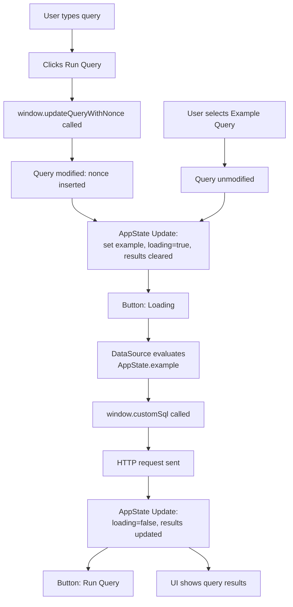

```mermaid
flowchart TD
    %% Manual Query Path
    A1[User types query] --> A2[Clicks Run Query]
    A2 --> A3[window.updateQueryWithNonce called]
    A3 --> A4[Query modified: nonce inserted]

    %% Example Query Path
    B1[User selects Example Query]
    B1 --> B2[Query unmodified]

    %% AppState Update
    A4 --> AS1[AppState Update:<br>set example, loading=true, results cleared]
    B2 --> AS1

    %% Immediate UI effect
    AS1 --> UI1[Button: Loading]

    %% Query Execution
    UI1 --> C1[DataSource evaluates<br>AppState.example]
    C1 --> C2[window.customSql called]
    C2 --> C3[HTTP request sent]
    C3 --> AS2[AppState Update:<br>loading=false, results updated]

    %% UI Updates
    AS2 --> UI2[Button: Run Query]
    AS2 --> D1[UI shows query results]
```