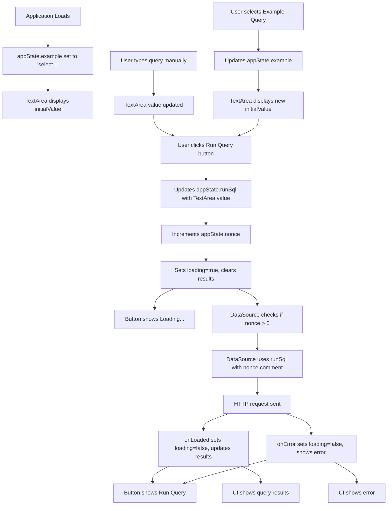

```mermaid

flowchart TD
    %% Initial Setup
    Z1[Application Loads] --> Z2[appState.example set to 'select 1']
    Z2 --> Z3[TextArea displays initialValue]

    %% Query Input Path
    A1[User types query manually] --> A1a[TextArea value updated]
    B1[User selects Example Query] --> B2[Updates appState.example]
    B2 --> B3[TextArea displays new initialValue]

    %% Run Query Path
    A1a --> A2[User clicks Run Query button]
    B3 --> A2
    A2 --> A3[Updates appState.runSql with TextArea value]
    A3 --> A4[Increments appState.nonce]
    A4 --> A5[Sets loading=true, clears results]

    %% Effects of Run Query
    A5 --> C1[Button shows Loading...]
    A5 --> C2[DataSource checks if nonce > 0]
    C2 --> C3[DataSource uses runSql with nonce comment]
    C3 --> C4[HTTP request sent]
    C4 --> C5[onLoaded sets loading=false, updates results]
    C4 --> C6[onError sets loading=false, shows error]

    %% UI Updates
    C5 --> D1[Button shows Run Query]
    C5 --> D2[UI shows query results]
    C6 --> D1
    C6 --> D3[UI shows error]

```